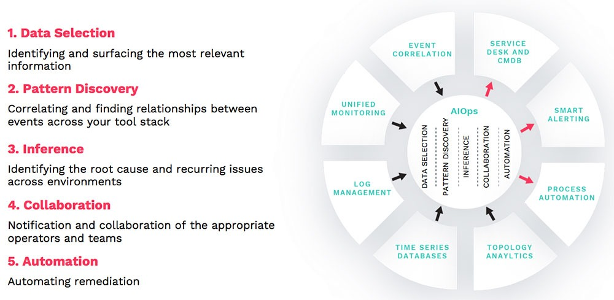

# Problem 1

## 1. In the notes of Week 1, we compared & contrasted MLOps with DevOps. In this question, you need to understand what is meant by the term ***AIOps***, & then contrast it with MLOps.

Ans: 
- AIOps (term invented by Gartner)
  - AIOps is the application of artificial intelligence to IT operations. It has become essential for monitoring and managing modern IT environments that are hybrid, dynamic, distributed and componentized. Through algorithmic analysis of IT data, AIOps helps IT Ops and DevOps teams work smarter and faster, so they can detect digital-service issues earlier and resolve them quickly, before business operations and customers are impacted.

  - Systems
      - At the core is the complexity of systems that are modular, distributed and dynamic, and whose components are ephemeral.

  - Data
      - The second layer is the data these systems generate about their internal operations — logs, metrics, traces, event records and more. This data is complex because of its high volume, specificity, variety, redundancy.

  - Tools
      - The third outer layer is the complexity of the tools used to monitor and manage the data, and the systems. There are more and more tools, with increasingly narrow functionality, that don’t always interoperate, and thus create operational and data silos.

  

- AIOps vs MLOps
  - Although the aim for both of them is two make our systems better we cannot mistakenly consider them to be similar as they are 
    different although there is a significant overlap.
  - While MLOps bridges the gap between cuilding of ML models and their execution, AIOps focuses on automating incidents management and intelligent root cause analysis.

## 2. ***Interpretable Machine Learning*** is another concept that has attracted lot of attention recently & is promoted by most of the MLOps frameworks. Explain what it means for a linear regression model to be interpretable. You may find [this resource](https://christophm.github.io/interpretable-ml-book/) useful.
Ans: When we say that a linear regression model is interpretable we mean that if we increase anything by a certain amount we can get to know what the increase in the output will be.
 - Interpretation of a Numerical Feature: We increase the xk unit by a certain amount we know that the overall output will increase according to the weight corresponding to x<subk</subtimes that certain amount.
 - Interpretation of a Categorical Feature: Changing feature xk rom the reference category to the other category increases the prediction for y by a certain amount
   when all other features remain fixed.
 - Important measurement for Interpretation - R2: 
    - Tells you How much your model explains the data. Ranges from 0 (models doesnt explain the data at all) to 1 (model fits the data perfectly)
    - Better to use adjusted R2 as R2 increases with number of features eventhough the features of are not related to the label.

 

